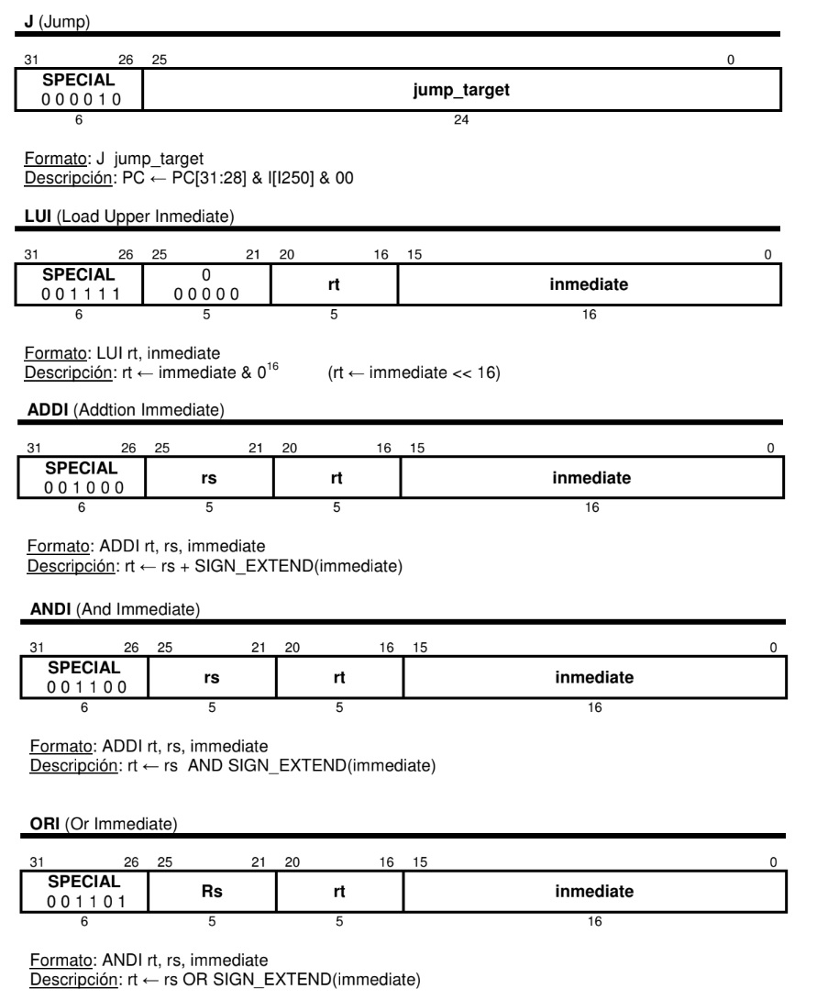

# Práctica de Laboratorio: Microprocesador MIPS Segmentado

- Trabajo Práctico
- Arquitectura de Computadoras I 
- Universidad Nacional de Tres de Febrero

## Integrantes

- Chavez, Matias. Legajo N° 41902
- Lottero, Bruno. Legajo N° 18434

## Objetivo

> El objetivo de esta práctica es ampliar a la implementación el microprocesador MIPS (visto en clase de teoría) en
VHDL. En concreto, se va a realizar la versión segmentada del microprocesador, cuyos detalles se
pueden encontrar en: "Computer Organization and Design: The Hardware/Software Interface ", por
David A.Patterson y John L. Hennessy.
El modelo de las memorias de datos y programas proporcionado (archivo memory.vhd) no introduce
ciclos de espera y responde en el mismo ciclo. Además, utiliza dos archivos separados para el
contenido inicial de cada memoria, archivo llamado “program1” para memoria de instrucciones y
“data” para memoria de datos. Se proporcionan un archivo de ejemplo (program1.s) para utilizar
junto con el testbench de la práctica, si bien se pueden generar otros archivos correspondientes a
otros códigos para hacer más pruebas.

## Ejercicio
Se dispone de la implementación de un procesador completo que admite las siguientes
instrucciones: add, sub, and, or, lw, sw, slt y beq. En cualquier caso, la instrucción beq, que implica
riesgos de control por ser un salto, funcionará “anómalamente” en la versión básica del ejercicio
obligatorio.

Se pide que al diseño completo del procesador MIPS segmentado realizado por la cátedra,
incorporar las siguientes instrucciones y verificar el diseño utilizando el archivo “program1”
proporcionado por la cátedra.

### Instrucciones a implementar
<p align="center">
  
</p>

## Resolución

### Agregado de Inmediatos

Para el agregado de las instrucciones LUI, ADDI, AND y ORI, se realizaron cambios sobre
- processor.vhd
  - Se aumento la dimension de la señal de control de la ALU de 2 a 3 bits, para soportar los inmediatos nuevos.
```vhdl
signal ALUOp: std_logic_vector(2 downto 0);
```
  - Se definieron en la etapa ID, las señales de control para las operaciones según fue necesario
```vhdl
      --LUI--
      when "001111" =>
		ID_RegWrite<= '1'; 
		ID_MemToReg<= '0'; 
		ID_MemRead<= '0'; 
		ID_MemWrite<= '0'; 
		ID_Branch<= '0'; 
		ID_RegDst<= '0'; 
		ID_AluOp<= "100"; 
		ID_ALUSrc<= '1';
      --ADDI--
      when "001000" =>
		ID_RegWrite<= '1'; 
		ID_MemToReg<= '0'; 
		ID_MemRead<= '0'; 
		ID_MemWrite<= '0'; 
		ID_Branch<= '0';
		ID_RegDst<= '0'; 
		ID_AluOp<= "101"; 
		ID_ALUSrc<= '1';
      --ANDI--
      when "001100" =>
		ID_RegWrite<= '1'; 
		ID_MemToReg<= '0'; 
		ID_MemRead<= '0'; 
		ID_MemWrite<= '0'; 
		ID_Branch<= '0'; 
		ID_RegDst<= '0'; 
		ID_AluOp<= "110"; 
		ID_ALUSrc<= '1';
      --ORI--
      when "001101" =>
		ID_RegWrite<= '1'; 
		ID_MemToReg<= '0'; 
		ID_MemRead<= '0'; 
		ID_MemWrite<= '0'; 
		ID_Branch<= '0'; 
		ID_RegDst<= '0'; 
		ID_AluOp<= "111"; 
		ID_ALUSrc<= '1';
      --J--
      when "000010" =>
		ID_RegWrite<= '1'; 
		ID_MemToReg<= '0'; 
		ID_MemRead<= '0'; 
		ID_MemWrite<= '0'; 
		ID_Branch<= '0'; 
		ID_Jump <= '1';
		ID_RegDst<= '0'; 
		ID_AluOp<= "011"; --alu va por others 
		ID_ALUSrc<= '1';
```
  - Se definieron en la etapa EX los casos anteriores en la unidad de control para la ALU
```vhdl
      when "100" => -- LUI
	  AluControl <= "100";
      when "101" => -- ADDI
	  AluControl <= "010";
      when "110" => -- ANDI
	  AluControl <= "000";
      when "111" => -- ORI
	  AluControl <= "001";
```
- alu.vhd
  - En la ALU se adecuó la operación para LUI y luego se redefinieron los valores del case en 3 bits
```vhdl
process(a, b, control)
begin
    case control is
    when "000" => aux <= a and b;
    when "001" => aux <= a or b;
    when "010" => aux <= a + b;
    when "110" => aux <= a - b;
    when "111" => 
        if(a<b) then
        aux <= x"00000001";
        else aux <= x"00000000";
        end if;
    when "100" => aux <= b(15 downto 0) & x"0000";  
    when others => aux <= x"00000000";   
    end case;  
       
end process;
```

### Agregado de Jump

Para el agregado de la J, se realizaron cambios sobre processor.vhd
- En primer lugar se creo la señal de Jump y las señales que resguardan el cálculo del salto
```vhdl
-- Control de mux jump
signal Jump: std_logic;

 --ETAPA ID--
signal ID_Jump: std_logic;

 --ETAPA EX--
signal EX_Jump: std_logic;
-- Para direccion de salto en jump
signal EX_PC_Jump: std_logic_vector (31 downto 0);
```

  - En la etapa ID se agrega el seteo de la señal de control del jump en CONTROL_UNIT según corresponda
```vhdl
ID_Jump <= '1';
```
o
```vhdl
ID_Jump <= '0';
```
  - Además se propaga la señal de control
```vhdl
EX_Jump <= ID_Jump;
```
- A continuación en la etapa EX, se realiza el cálculo del salto para el J y se propaga la señal

```vhdl
-- Calculo dirección de salto (Jump)
EX_PC_Jump <= EX_PC_4(31 downto 28)&EX_immediate(25 downto 0)&"00";
-- Control de Jump
Jump <= EX_Jump;
```

  - Por ultimo, en la etapa IF, se aplica nueva lógica para decidir como cargar el PC según como se hayan cargado las señales antes mencionadas

```vhdl
  next_PC <= MEM_PC_Branch when (PcSrc = '1') else
		EX_PC_jump when ((PcSrc = '0') and (Jump = '1')) else
		PC_4;
```

Mediante esta lógica podemos tener una instrucción BEQ y a continuación una J en memoria de instrucciones y el funcionamiento va a ser el esperado (no se necesitan NOP) se escribió el programa **probando_beq_j.s** para comprobar dicho funcionamiento.


## Flush del datapath ante saltos

Para complementar lo visto en clase y por una cuestión de consistencia con la lógica anterior, optamos por agregar el flush de las etapas que corresponden.
El diseño de este procesador MIPS trabaja sin predicción de saltos, o tambien podriamos decir que realiza predicción no efectiva (se asume que el salto no es efectivo).
De esta manera, cuando realmente se efectua un salto, es necesario limpiar las etapas que contienen instrucciones mal cargadas.
Para realizar esto, aplicamos una logica de reset en los cambios de etapa, a saber:

  - La existencia de un BEQ se conoce en la etapa ID sobre la señal ID_Branch y la misma se propaga hasta la etapa MEM en 
  la señal Branch, ya que recién en la etapa EX se confirma la efectividad del salto. 
  Luego, en caso positivo, se limpian los registros IF/ID-ID/EX-EX/MEM para poder cargar el PC correcto a donde apunta el salto.

  - Luego para el caso del J, se conoce tambien en la etapa ID la señal ID_Jump, la misma se propaga hasta EX en 
  donde se carga finalmente la señal Jump. Luego al avanzar un ciclo, estando el J en etapa MEM, se deben limpiar los registros IF/ID-ID/EX-
  
  - Para probar el funcionamiento, se escribieron los programas adicionales de prueba: 
  	- **probando_flush_beq.s**
	- **probando_flush_j.s**
	- También es válido para probar esto el programa **Program1.s** provisto originalmente
 
```vhdl
-- REGISTRO DE SEGMENTACION IF/ID      
      if (PcSrc = '1' or Jump = '1') then
        ID_PC_4 <= (others => '0');
        ID_Instruction <= (others => '0');
        
-- REGISTRO DE SEGMENTACION ID/EX
      if ( PcSrc = '1' or Jump = '1') then
        EX_data1_rd <= (others =>'0');
        EX_data2_rd <= (others =>'0');
        EX_RegWrite <= '0' ;
        EX_MemToReg <= '0' ; 
        EX_MemRead <=  '0' ;
        EX_MemWrite <=  '0' ;
        EX_Branch <=  '0' ;
        EX_Jump <=  '0' ;
        RegDst <=  '0' ;
        ALUOp <= (others =>'0');
        ALUSrc <= '0' ;
        EX_immediate <= (others => '0');
        EX_rt <= (others => '0');
        EX_rd <= (others => '0');
 -- REGISTRO DE SEGMENTACION EX/MEM
      if ( PcSrc = '1') then
        MEM_RegWrite <= '0';
        MEM_MemToReg <= '0';
        MEM_MemRead <= '0';
        MEM_MemWrite <= '0';
	Branch <= '0';
        MEM_Zero <= '0';
        MEM_AluResult <= (others => '0');
        MEM_data2_rd <= (others => '0');
        MEM_Instruction_RegDst <= (others => '0');
	MEM_PC_Branch <= (others => '0');
```
